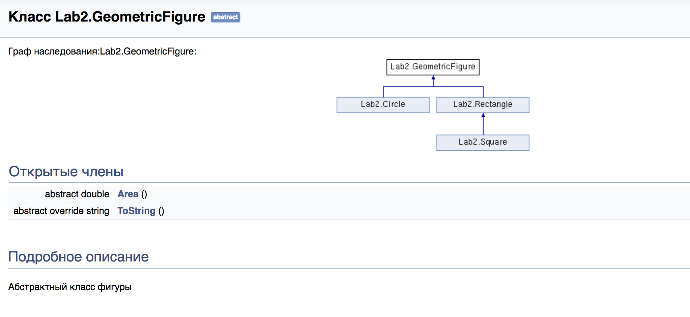
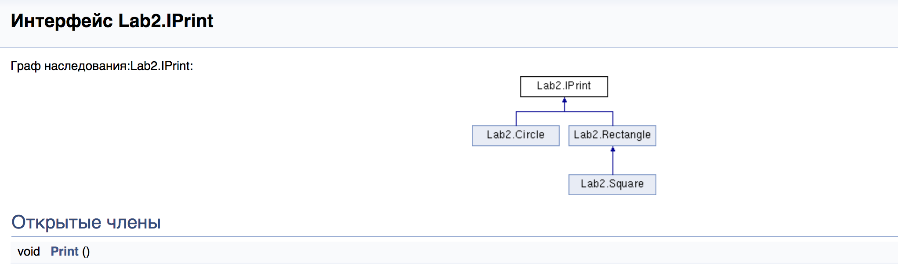
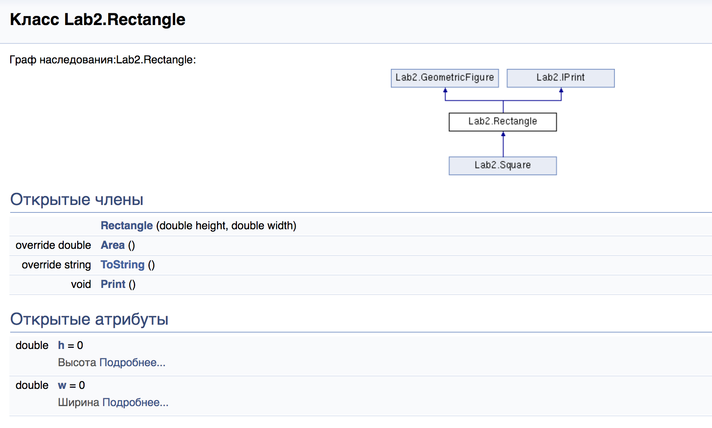
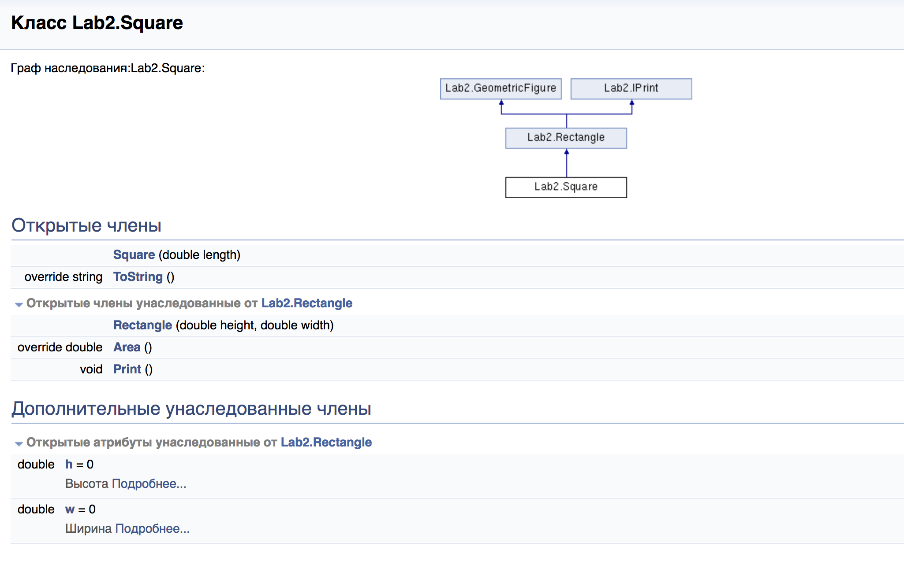
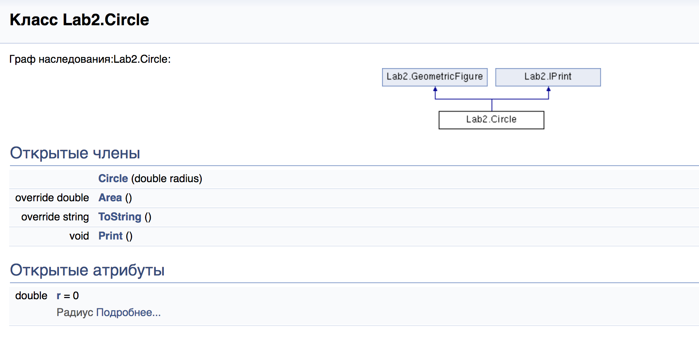

## Лабораторная работа №2

### I.	Описание задания
Разработать программу, реализующую работу с классами.
1.	Программа должна быть разработана в виде консольного приложения на языке C#.
2.	Абстрактный класс «Геометрическая фигура» содержит виртуальный метод для вычисления площади фигуры.
3.	Класс «Прямоугольник» наследуется от «Геометрическая фигура». Ширина и высота объявляются как свойства (property). Класс должен содержать конструктор по параметрам «ширина» и «высота».
4.	Класс «Квадрат» наследуется от «Прямоугольник». Класс должен содержать конструктор по длине стороны.
5.	Класс «Круг» наследуется от «Геометрическая фигура». Радиус объявляется как свойство (property). Класс должен содержать конструктор по параметру «радиус».
6.	Для классов «Прямоугольник», «Квадрат», «Круг» переопределить виртуальный метод Object.ToString(), который возвращает в виде строки основные параметры фигуры и ее площадь.
7.	Разработать интерфейс IPrint. Интерфейс содержит метод Print(), который не принимает параметров и возвращает void. Для классов «Прямоугольник», «Квадрат», «Круг» реализовать наследование от интерфейса IPrint. Переопределяемый метод Print() выводит на консоль информацию, возвращаемую переопределенным методом ToString().

### II. Схема данных







### III. Код программы

[Исходный код](https://github.com/RBizonDota/BCIT/blob/master/Lab_2/Lab_2/Program.cs)

### IV. Примеры работы программы

```

```

### <p align="right"> Автор: [Михаил Кучеренко "SnipGhost"](https://vk.com/snipghost), 04.10.2017 </p>
